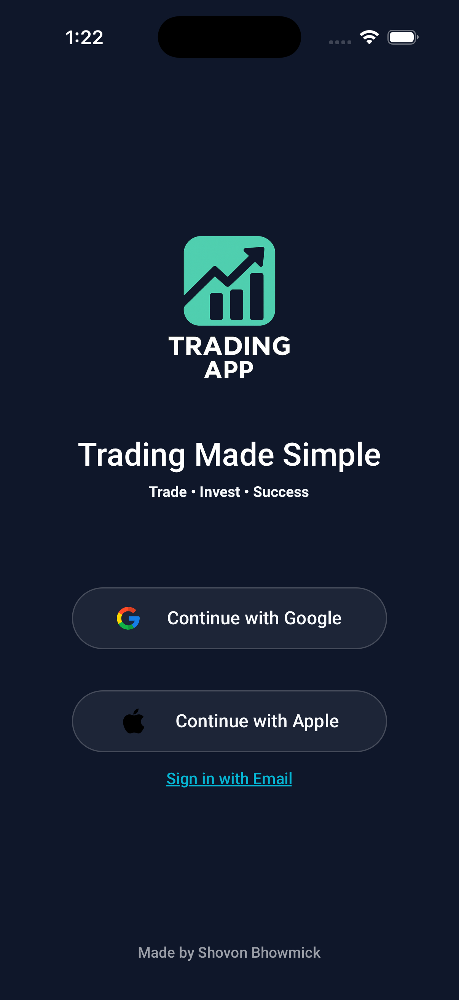
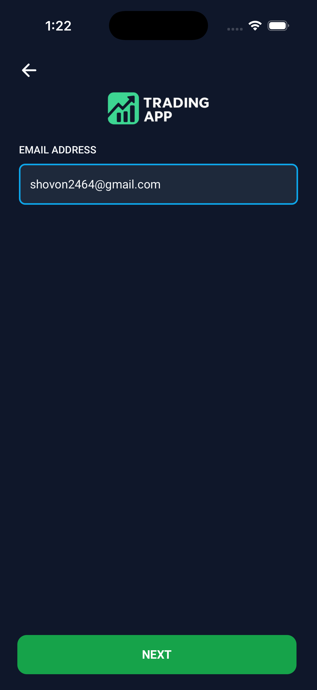
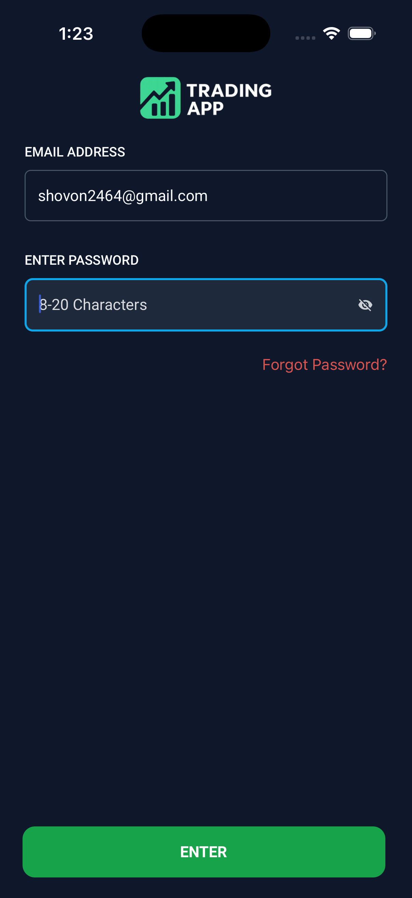
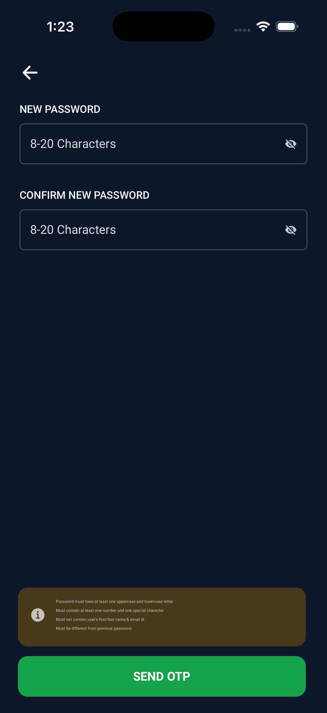
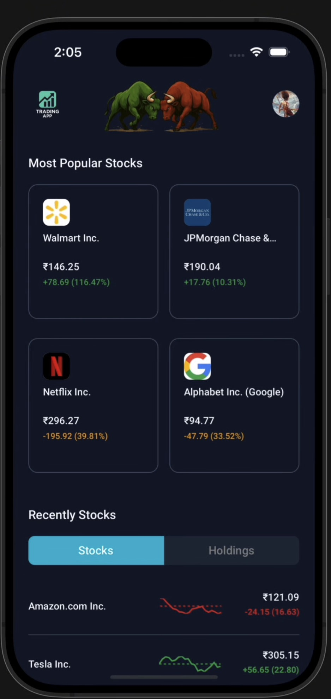
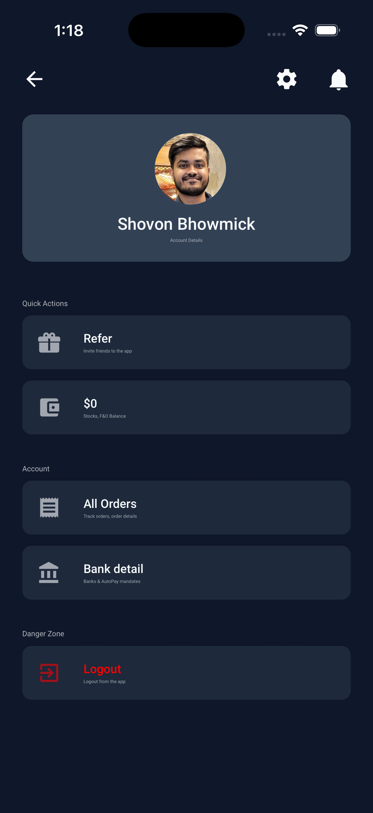
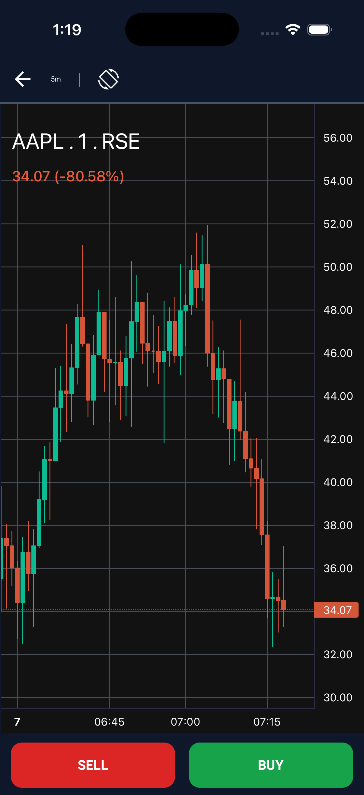
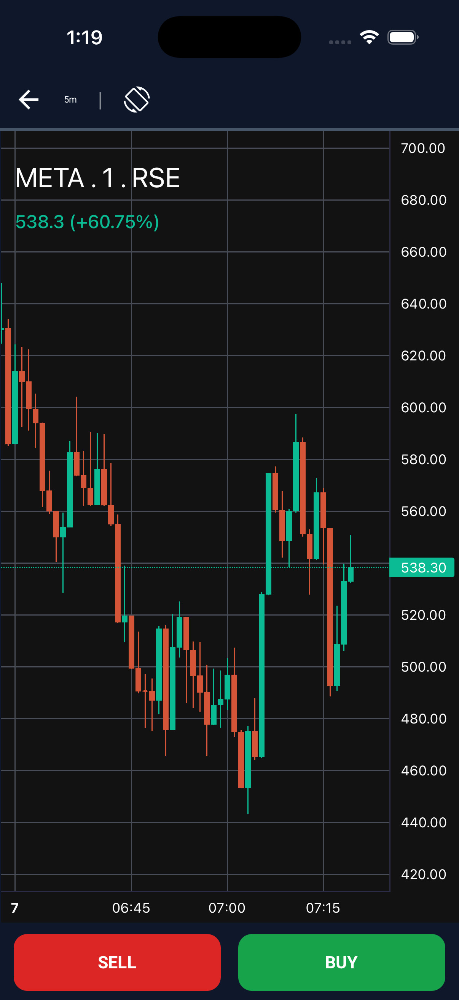
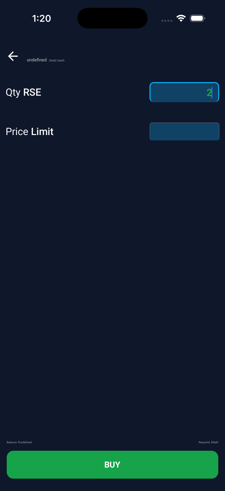

# Trading App

A modern full-stack mobile trading application built to deliver a smooth, real-time stock trading experience.  
This project combines a **React Native mobile frontend** with a **Spring Boot backend**, powered by **REST APIs**, **WebSocket communication**, and a scalable containerized infrastructure.

## Overview

The Trading App is designed to simulate a real-world trading platform where users can:

- Sign up and log in securely
- View popular and recent stocks
- Analyze stock performance through live charts
- Buy and sell stocks in real time
- Track holdings and account activity
- Manage profile and banking details
- Receive live updates using WebSockets

The app focuses on delivering a clean user experience, responsive mobile UI, and a robust backend architecture.

---

## App Preview

### Authentication Flow

  
  
  
  

### Dashboard & Profile

  
  

### Market Charts

  
  

### Trading Actions

  
  

---

## Tech Stack

### Backend
- **Spring Boot** – backend application framework
- **Spring Security** – authentication and authorization
- **REST API** – client-server communication
- **WebSocket** – real-time stock and trading updates
- **MySQL** – relational database for structured transactional data
- **MongoDB** – document database for flexible/unstructured data
- **Flyway** – database migration and version control
- **Docker** – containerization
- **Docker Compose** – multi-service local development and deployment orchestration

### Frontend
- **React Native** – cross-platform mobile application
- **Redux** – predictable global state management
- **WebSocket Client** – real-time UI updates
- **React Navigation** – screen and route management
- **Axios / Fetch API** – backend API integration
- **Charting Library** – stock chart visualization
- **Async Storage / Secure Storage** – local persistence for session/app data
- **Reusable Component Architecture** – modular UI development

---

## Key Features

### Authentication & User Access
- Email-based sign in
- Google sign in
- Apple sign in
- Password recovery / reset flow
- Secure session handling

### Trading Experience
- Browse most popular stocks
- View recently accessed stocks
- Buy stocks
- Sell stocks
- Quantity and price limit based order placement
- Holdings overview
- Order tracking

### Real-Time Updates
- Live stock price updates using WebSockets
- Dynamic chart refresh
- Instant trading-related UI updates

### User Account Management
- User profile page
- Account details management
- Bank detail section
- Balance and wallet-related views
- Logout functionality

### UI/UX Highlights
- Dark themed modern trading interface
- Mobile-first responsive layouts
- Interactive chart screens
- Clean card-based stock browsing experience

---

## Architecture Summary

This project follows a **full-stack client-server architecture**:

- The **React Native frontend** provides the mobile user interface
- The **Spring Boot backend** handles business logic, APIs, authentication, and trading workflows
- **MySQL** stores structured transactional and relational data
- **MongoDB** supports flexible data storage where needed
- **WebSockets** enable real-time communication for stock and trade updates
- **Docker Compose** manages all backend services consistently across environments

---

## Project Goals

This application was built to demonstrate:

- Full-stack mobile application development
- Real-time communication with WebSockets
- Hybrid database architecture using SQL + NoSQL
- Secure and scalable backend development with Spring
- Containerized deployment workflows with Docker

---

## Screens Included

The current application includes screens/features such as:

- Splash / Welcome screen
- Social and email login
- Password reset
- Home dashboard
- Stock listing sections
- Stock detail chart screen
- Buy/Sell order screen
- Profile page
- Orders page
- Bank details page

---

## Why This Project Stands Out

- Combines **mobile app development**, **backend engineering**, and **DevOps tooling**
- Demonstrates **real-time system design**
- Uses both **MySQL** and **MongoDB** for different data needs
- Built with a clean, modern UI inspired by trading platforms
- Structured for scalability and maintainability

---

## Future Improvements

- Watchlist support
- Portfolio analytics
- Transaction history insights
- Push notifications
- Advanced candlestick indicators
- Payment gateway / wallet integration
- Admin dashboard
- Cloud deployment pipeline

---

## Author

**Shovon Bhowmick**

Built with a focus on modern mobile trading experience, scalable backend design, and real-time data flow.